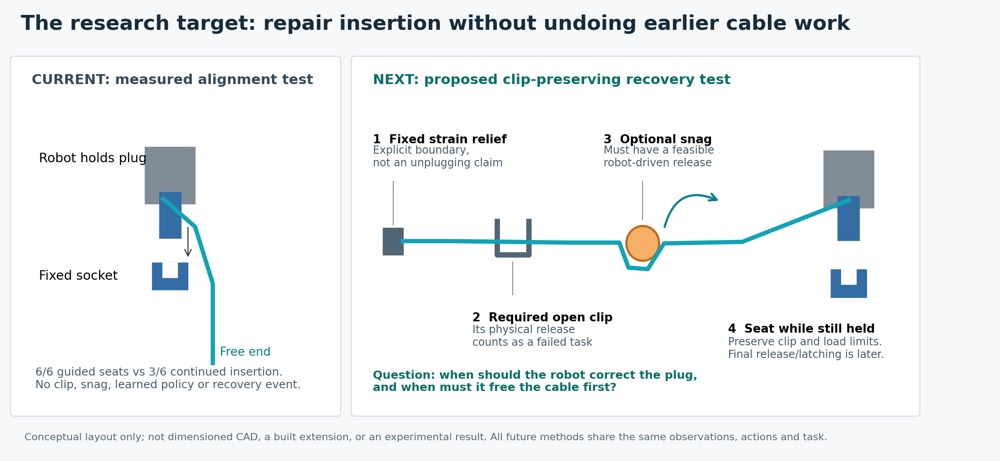

# Assembly Recovery Lab

**Help a robot recover from connector insertion failures without pulling a cable out of work already completed.**

The industrial problem is interrupted work: an insertion misses, binds or stalls, and the robot needs another chance without damaging the part. This project studies how a robot can learn that second chance efficiently from its own experience.

The active cycle studies industrial cable handling and SC connector insertion using pinned Intrinsic AIC assets. It starts with a native MuJoCo adapter around the public UR5e model on this Windows workstation. The earlier Franka/FORGE peg study remains preserved below; its scores are not cable results. Everything demonstrated here is simulation. The old space-rack project remains retired.

[ROADMAP.md](ROADMAP.md) contains the current research plan, verified state and next action. [AGENTS.md](AGENTS.md) contains the operating rules. These are the only three maintained Markdown files.

The current execution handover is prepared for **Claude Opus 5**. In this local workspace, ask it to read and execute `artifacts/prompts/cable_recovery_audited_handover_20260910.txt`. The prompt explicitly loads the maintained instructions and carries the full experimental campaign; the simulator and project code do not depend on the assistant provider.

## The audited research direction

**Goal:** when a connector insertion fails, choose a physical repair that finishes insertion while preserving an earlier cable clip and respecting load/time limits. A correction near the plug may tension the rest of the cable; clearing a snag may disturb local alignment. The useful question is when a learned predictor of repair consequences improves this choice beyond competent rules or cable-aware planning.

The first study will end with the plug **still held by the robot**. Its outcome is *clip-preserving held seating*, with real contact and a declared dwell. Released/latching connection, pickup, electrical/optical function and hardware transfer are later claims requiring their own evidence. This is a prospective task definition; earlier runs are not rescored under it.



The proposed apparatus has a fixed strain-relief boundary, one physically escapable required clip, one optional shallow post that can catch the distal span, and a fixed socket. The clip must be capable of being lost by a bad repair; a weld or closed collar cannot substitute for that test. All methods receive the same available state/history and use the same validated repair actions. The geometry in the diagram is conceptual, not a built or validated extension.

## What the current video actually shows

The grey shapes are the gripper/collision representation, the upper blue part is the held SC plug, the lower blue part is the fixed socket, and the cyan line is a cable with a free other end. The socket is fixed to the simulated world, although its support is not visible. Guided insertion moves only about 23 mm along its saved path. There is no earlier clip or snag. Both controllers are scripted: the left aligns using the known target and force feedback; the right continues on its original axis.

That small alignment test is useful infrastructure evidence, but it is **not learned cable recovery**. The [19.5-second replay and provenance](evidence/cable_video_v1.json) preserves the actual trajectories, speeds and held final frames. Its local MP4 is `artifacts/cable/cable-video-v1/cable_comparison.mp4`.

| Executed evidence | What it establishes | What it does not establish |
| --- | --- | --- |
| Guided seating 6/6 versus continuation 3/6 | Actual-target alignment/prevention on six deterministic development cases; three continuation contact-stall timeouts | Learned recovery, force-compensation causality, performance against a strong cable-aware method, or broad reliability |
| Native UR5e with deforming cable | A runnable Windows MuJoCo/AIC adapter, physical connector contact and bounded insertion/retraction | Accurate camera perception, grasp-slip behavior, calibrated cable mechanics or isolated timestep convergence |
| Isolated SC extraction test | This rigid model supplies no opposing contact under 0.5/2 N extraction after seating, at both tested resolutions | Real SC connector retention strength, failure of official AIC scoring, or a universal prohibition on pre-release recovery research |
| Source and artifact verification | Pinned sources, exact run-time snapshots, preserved failures and 375 passing CPU tests at the cycle release | Scientific validity of unimplemented clips, snags, mutation guards or a future learned comparison |

The [baseline](evidence/cable_baseline_v2.json), [native validation](evidence/cable_robot_validation_v1.json) and [retention measurements](evidence/cable_retention_v1.json) retain their original scopes. The original cycle used 37 physical trials and 1,185,841 explicit native integration steps, including initialization and failures. Its 595.203 s summed launcher time excludes setup, implementation and review. No cable policy was trained. Historical peg training and capacity results below remain separate.

## What the audit changes

The earlier **latch-first stopping rule was too broad**. Pinned AIC abstracts terminal connection through touch and attachment logic; our passive extraction test was a stricter project requirement. Its negative result remains valid for released-connection claims. It does not prevent a separately registered retained-grasp recovery study. The old decision now contains an explicit interpretation-supersession note; no numerical result was deleted or changed.

The immediate engineering work is to build the actual constrained-cable task and repair its measurement contract. The present worker supplies placeholder zero anchor/post loads and true clip/grasp flags. Its mutation fields are not a functioning runtime guard. Robot timestep changes also changed servo cadence; native and extra post-forward force calculations were mixed for aborts. Sparse pose logs cannot independently replay every native completion/stall predicate. The compiled cable is **53.3 g**, although its nominal mass was 50 g; mass, rest length and constitutive behavior must be conserved during spatial refinement. See the [technical audit](evidence/cable_technical_audit_v2.json).

These issues require targeted controls, not an endless attempt to perfect every simulator detail. Fix clocks and instrumentation, construct one feasible clip/post scenario, and demonstrate an actual failure followed by an actual robot-driven repair before expanding training.

## What would make the contribution worthwhile

A graph or prediction network is not the contribution by itself. [Wilson](https://arxiv.org/html/2303.11765v1) already studies tactile cable assembly and retries; [Luo](https://arxiv.org/html/2307.08927v5) studies learned corrective selection; [Kienle](https://arxiv.org/html/2503.09409v1) uses predictive models for connector optimization. Cable-load compensation is also established. The [targeted research critique](evidence/cable_research_critique_v2.json) records the inspected methods and their overlap.

The attainable contribution is an empirical answer: **when do learned repair consequences improve constrained-cable recovery, at what data/inference cost, and on which unseen layouts or mechanical combinations?** First compare real repair choices against visible-snag rules and a compact cable-aware planner. If they leave a feasible residual problem, start with a small action-outcome model over the same repair library. Compare it with separate local/distal predictors and a direct history-based selector using the same observations, data and actions. A factorial interaction alone does not prove that a joint model adds value; better prediction alone does not prove better control.

A positive claim needs held-out action validation, better closed-loop clip-preserving outcomes, appropriate ablations, matched budgets and multiple training starts. A useful negative result identifies where a simpler method already suffices. Neither outcome nor publication is guaranteed. Simulator integration and a missing latch alone are not a new robot-learning method.

The next session has an ambitious execution mandate: finish the task and instrumentation, establish strong baselines, collect substantial physical repair data, train and challenge the justified method, and run held-out evaluation with a clear demo. Small starter probes are not the deliverable. Actual campaign size comes from measured throughput and protected evaluation time.

The [integrated audit](evidence/cable_direction_audit_v2.json), [prospective study contract](configs/cable_recovery_study_v2.json), and active action in [ROADMAP.md](ROADMAP.md) govern the next session. The new contract is a plan, not a runnable worker configuration or a claim that the extension has passed its gates.

## Run the existing checks and demonstrations

```powershell
.venv/Scripts/python.exe scripts/setup_cable.py
.venv/Scripts/python.exe -m ruff check src scripts tests
.venv/Scripts/python.exe -m pytest
```

The [dependency lock](configs/cable_dependencies_v1.json) pins the current native runtime. `scripts/setup_cable.py --install` prepares it when needed. Existing diagnostic workers remain runnable through `scripts/run_cable.py` with unique IDs and their original configurations. The recorded-state video can be regenerated using `configs/cable_video_v1.json` and `scripts/render_cable_video.py` when the original ignored artifacts are available. No old diagnostic command constitutes the proposed clip/snags study.

Current dynamics run on CPU; the old 2,048-environment peg result does not establish cable capacity. Profile the corrected task with rendering off before choosing data/training size. Keep a single simulator/GPU queue and record actual acquisition, initialization, failed probes, inference and evaluation costs.

## Preserved peg research decision

The registered question was whether **explicit exposure to physically generated failed attempts improves learned assembly recovery at equal training cost**, compared with ordinary fault training and strong scripted retry. The candidate uses the same policy, observations, fault support and reward, with a four-second scripted first attempt on half the fault training jobs. Scripted actions and rewards are excluded from PPO losses and their simulation cost is charged.

**This cycle rejects advancing that fixed-prefix comparison under the current task. The candidate effect remains untested.** Ten simulator processes completed: two representative PPO capacity runs and eight scripted contact diagnostics. The final physical/support gates failed, so the registered stopping rule closed the campaign before candidate training, new full-job comparisons or gear work. See the [executed decision and cost ledger](evidence/research_cycle_decision_v1.json) and [prospective research registration](configs/recovery_teaching_registration_v1.json).

| Native physics | Original 120 Hz servo: force aborts / 28 | 480 Hz servo | 480 Hz servo + 20 mm/s reference |
| --- | --- | --- | --- |
| 120 Hz | 1 | Not run | Not run |
| 240 Hz | 13 | Not run | Not run |
| 480 Hz | 26 | 27 | 25 |
| 960 Hz | 27 | 27 | 26 |

These are **four-second scripted prefixes**, with the same 28 development cases and native raw 20 N wrist abort. Requests still active at four seconds are censored. None of the tested 480/960 Hz conditions leaves a **witnessed contact stall active at handoff**; the remaining active requests do not supply the failure cohort the candidate needs.

The final reference-limited pair leaves two and one requests active, below its registered support floor. Its outcome-count and wrist-peak margins pass, but its terminal-censored contact-impulse margin fails (58.01% median paired difference). That impulse statistic alone cannot establish physical nonconvergence. The absent witnessed-stall cohort independently defeats this recovery assay. Finer physics is not assumed to be ground truth, and the exact cause remains unresolved.

The [approach audit](evidence/precontact_dynamics_audit_v1.json) finds millimetre-scale differences before substantial measured fixture contact. The [force-frame audit](evidence/force_frame_audit_v1.json) confirms that the actor effectively receives end-effector-frame forces despite misleading inherited variable names. Neither a frame rotation nor one-unit float32 rounding errors explains the abort counts. The two controller interventions retain geometry, gains, clamps, gravity, observations, rewards and the raw 20 N rule. The 20 mm/s limit governs the Cartesian reference, not actual tool speed or a force ceiling.


The [capacity comparison](evidence/training_capacity_v2.json) completed two fresh PPO cohorts each at 1,024 and 2,048 environments, including initialization, optimizer work, diagnostics and checkpoint export/reload. Including startup, 2,048 yields **29.1% more active samples/s** and **38.6% more charged transitions/s**, with 6,499 MiB peak GPU use. It earns adoption for this runtime; a changed physical task requires new profiling. About 72-74% of slots were absorbing, but no wholly terminal trailing interval existed, so simple cohort early-exit would save nothing. Unequal work and active samples make this a capacity result.

This cycle charged **2,883,652 reference transitions**, bringing the tracked project lower bound to **27,878,867.25**. A reference transition is eight executed native physics environment steps. Every initialization, absorbing slot and failed verdict is retained. Three CPU checker failures were corrected with versioned evidence and zero simulator reruns. Four new benchmark checkpoints are engineering artifacts; the preserved 10.326M ordinary policy remains the only completed research-policy training run of that budget. No candidate or adaptive training benefit is established.

The [final verification record](evidence/research_cycle_verification_v1.json) includes the source-only tests, checkout byte checks and 84 rechecked run-artifact hashes.

The bounded engineering contribution is the measured failure of this assay to retain its target failure cohort under refinement, together with an executed capacity improvement. Further learned comparisons require a new, independently justified physical/load specification and a failure generator that actually leaves retained-grasp contact stalls. This fixed-prefix campaign is closed; further incremental tuning is not queued.

## Why this direction

Physical Intelligence describes reliability, throughput and learning from a robot's own mistakes as central problems in its work on [learning from experience](https://www.pi.website/blog/pistar06). This project addresses a small, measurable version of that problem.

NVIDIA's [FORGE](https://arxiv.org/abs/2408.04587) already provides force-aware assembly learning, and [AutoMate](https://developer.nvidia.com/blog/?p=85056) studies assembly across geometries. We use the installed FORGE infrastructure instead of rebuilding a simulator and gripper. [ARCH](https://long-horizon-assembly.github.io/) already demonstrates hybrid assembly and recovery. The July 2026 [FORGE-plus preprint](https://arxiv.org/abs/2607.21227) also studies force-budgeted recovery with a frozen LLM supervisor. The registered learning question concerns the cost and effect of explicit failure exposure. The current cycle rejected its proposed assay before candidate training.

[Beltran-Hernandez et al. (2022)](https://arxiv.org/html/2204.12844v2) already compare adaptive and fixed curricula for industrial insertion. [Yu and Lee (2026)](https://scholarx.skku.edu/item/822cdd01-3c7c-4237-afdd-43cc4e05bbb6) describe recovery-oriented peg insertion with adaptive difficulty sampling and static/no-curriculum comparisons. Their full implementation details were unavailable in this review, so missing evaluation features cannot be assumed. Reverse curricula, IndustReal and general learning-progress/level-selection methods add further overlap. **Algorithmic novelty is unsupported.** The [contribution review](evidence/contribution_review_v1.json) records the primary sources, distinctions and limits.

The skills this project can demonstrate include reinforcement learning, force-aware control, fault diagnosis, reproducible GPU experiments and reliable evaluation. These overlap directly with the training, evaluation, scalability and failure-analysis responsibilities in [World Labs' robot-learning role](https://job-boards.greenhouse.io/worldlabs/jobs/4333272009). This is preparation for that work; a simulation project does not establish hardware deployment experience.

## What is actually working

The project now has a verified tensorized finite-job training path around pinned FORGE: complete-job scoring, actor/critic separation, terminal rewards and returns, contact sensing, mutation guards and transition accounting. Lint and 299 CPU tests pass, including a source-only checkout. Protocol v2 is frozen in `configs/protocol_v2.json`; upstream source remains unchanged.

A fresh uniform-fault PPO pilot completed 2,346,880 charged transitions at 1,024 environments in 23.4 minutes. Its saved checkpoint reloads correctly. **The deterministic policy completed 0/84 development jobs: 80 timeouts and 4 force aborts, including 0/12 nominal completions and zero witnessed recoveries.** That pilot did not produce a competent learned assembly policy. See [evidence/uniform_pilot_v2.json](evidence/uniform_pilot_v2.json). An earlier pilot stopped on a rare initial action-bound failure; its partial checkpoints and the verified correction remain preserved in [evidence/initial_action_projection_v2.json](evidence/initial_action_projection_v2.json).

Physical recovery is demonstrated by the fixed scripted controller. The original 84-case matrix records 60/84 completions versus 14/84 continued insertions and 39 scripted-phase witnessed recoveries. A separate lower/interior/upper support grid gives 73/96 versus 18/96 completions, with all 192 initializations valid. These establish sampled recovery support, not a learned-method advantage or proof of every continuous case. Controller tuning remains capped. See [evidence/peg_fault_matrix_v1.json](evidence/peg_fault_matrix_v1.json) and [evidence/training_support_v1.json](evidence/training_support_v1.json).

A fresh uniform policy with completion credit and unclipped value regression completed **10,326,272 charged transitions in 111.5 minutes**. Its final deterministic policy completed **81/84 development jobs: 12/12 nominal and 69/72 fault cases**, with two force aborts and one deadline. All 22 checkpoints, optimizer states, source snapshots and evaluation artifacts are verified. These are one training seed and three development seeds, not final-test results. See [evidence/uniform_unclipped_v4.json](evidence/uniform_unclipped_v4.json).

The primary evaluation encountered no witnessed contact stalls, so a separate registered test applied the same four-second scripted insertion attempt before handing control to the learned policy, unchanged retry, or continued insertion. They completed **22/28, 19/28 and 3/28 whole jobs**, respectively. Among the same **17 witnessed stalled jobs still active at handoff**, learned actions and scripted retry each completed **13/17**, while continued insertion completed **0/17**. Each arm also includes three completions produced by the scripted prefix and two prefix force aborts. This establishes measured post-stall correction on that development set; it is not a compute-matched curriculum comparison. See [evidence/failure_prefix_v4_r01.json](evidence/failure_prefix_v4_r01.json).

The learned correction uses lateral motion: its 13 completed stalled cases rise at most 1.07 mm after failure, with 2.83?9.07 mm lateral displacement after handoff. The existing witness requires a 5 mm withdrawal and therefore reports zero learned withdrawal recoveries. **The original competence gate remains failed; its definition has not been changed retrospectively.** Both endpoints and all failures are retained. A separate mechanism-neutral endpoint is preregistered in `configs/failure_prefix_confirmation_v2.json`. It requires a real contact stall before the fixed handoff, later completed dwell and retained grasp without forbidden events; it keeps whole-job and conditional denominators separate. The measured [motion review](evidence/failure_prefix_motion_v1.json) records every common prefix failure and links a PNG/PDF comparison selected by a declared rule.

The two remaining development seeds, 10071 and 10072, now confirm that endpoint. Learned actions, unchanged retry and continued insertion complete **47/56, 47/56 and 11/56 whole jobs**. Among the same **37 witnessed stalled jobs active at handoff**, they complete **30/37, 31/37 and 1/37**. Each arm includes six scripted-prefix completions and one prefix force abort. Learned actions complete 16/17 and 14/20 stalled jobs on the two seeds; retry completes 16/17 and 15/20. All 30 learned post-stall completions rise less than 0.91 mm, so the original withdrawal count stays zero. Learned and retry have the same aggregate whole-job completion count; mean time per request is 11.46 versus 18.01 seconds, including failures. These are descriptive results from one trained model, with no learned reliability advantage over retry established. See the [verified confirmation](evidence/post_stall_confirmation_v2_verified.json).

All six runs used clean preregistration source and exactly **77,007 charged transitions**, with no additional training. Exact physical prefixes, sensor/RNG pairing, native physics replay and unchanged scripted actions are verified. The [block evidence](evidence/post_stall_confirmation_block_v2.json) preserves the CPU checker/export corrections and the unchanged measurements. At that checkpoint both seeds supported moving to bounded learned-policy physics refinement. The subsequent diagnostic cycle above rejected advancing the fixed-prefix comparison. The original competence gate remains failed.

The earlier reward diagnosis found that failed stalls outreturned 10 of 19 matched successful retries; completion credit removes those observed counterexamples with bitwise physical parity. A controlled CPU test then reduced critic-fit error from 222.58 with value clipping to 10.43 without at equal optimizer work. Interrupted v3 and v4 runs remain failed, with all partial checkpoints and costs preserved; no partial weights initialized the completed run. See [reward diagnosis](evidence/diagnosis_decision_v3.json), [critic diagnosis](evidence/critic_fit_v1.json), [v3 interruption](evidence/uniform_completion_v3_r01_failure.json), and [v4 interruption](evidence/uniform_unclipped_v4_r01_failure.json).

The preserved earlier [bounded comparison design](configs/contribution_screen_v1.json) specifies three learning arms and three training seeds at about 3M charged transitions each, plus matched direct-job and post-stall evaluations against unchanged retry. It is gated on learned-policy physics validation and a newly frozen common protocol. An offline audit of already charged training logs found little differentiation in the proposed score near 3M; late failures were mostly force aborts rather than witnessed stalls. That audit predicts no counterfactual performance and supports keeping the first spending decision small. No new simulator training ran during the contribution review.

The [frozen learned/retry physics validation](evidence/learned_physics_validation_v3.json) now compares all 28 development cases on seed 10071 at 120 and 240 Hz. Policy updates stay at 15 Hz and servo/sensor updates at 120 Hz. Both resolutions independently use the confirmed coarse initialization. Native integration steps, force conversion, observation/RNG pairing and unchanged actions/rewards are verified; the 120 Hz prefix trajectories reproduce the confirmed assay bit for bit.

| Controller and assay | 120 Hz completion | 240 Hz completion |
| --- | --- | --- |
| Frozen learned, direct job | 27/28 | 20/28 |
| Frozen learned after the four-second prefix | 25/28 | 11/28 |
| Unchanged scripted retry | 24/28 | 12/28 |

The retry trajectory serves both comparisons and is counted once. **Material physics sensitivity blocks the training screen.** Shared-prefix force aborts rise from one to 13 before learned control begins. Among stalled jobs still active at handoff, learned/retry complete 16/17 and 16/17 at 120 Hz versus 3/5 and 2/5 at 240 Hz. All five fine-cohort cases also belong to the coarse cohort, where both controllers complete 5/5. The direct learned runs encounter no witnessed stalls at either timestep; they measure insertion/prevention. Learned withdrawal recoveries remain zero and the original competence gate remains failed.

All 41 force aborts in the final fine trials coincide with measured peg?fixture contact; 17 occur between external sensor ticks. Short peaks remain failures under the frozen raw 20 N rule. Lower mean completion/abort time at 240 Hz includes early failures and does not establish improved throughput. Two resolutions establish sensitivity, not convergence. The subsequent four-resolution and controller diagnostics are complete and reported above; the fixed-prefix campaign is now closed.

The final six runs pass 357 scientific/artifact checks and nine provenance checks. Earlier CPU-checker and backend failures remain preserved. Changing scene timing invalidated simulator tensor views before the first fine job step; the corrected version uses the installed native simulate/fetch calls with explicit dt and reruns both resolutions. All nine complete trials plus that failed initialization cost **153,545 charged reference transitions**, counting every eight native physics environment steps as one reference transition. The [backend failure](evidence/learned_physics_backend_failure_v2.json) and [checker failure](evidence/learned_physics_verifier_failure_v1.json) remain immutable. There was no new training or final-test use.

The study retains physical held-part gravity, the 30-second deadline, native raw 20 N wrist-load abort and 0.5-second seating dwell. Robot gravity compensation is idealized; observations are simulator poses with synthetic noise. The earlier four scripted development pairs remain separate evidence (2/4 versus 1/4). Contact robustness, gear, multiple training seeds and final tests remain open. No pickup, dropped-part recovery, camera perception, hardware transfer or force-certified safety is established. The [research assessment](evidence/research_assessment_20260909.json) records earlier prior-art boundaries. The newly executed 2048 measurement is reported above; 4096 was not run. ROADMAP.md contains the single next action.

## What the audit changed

The old repository combined several research questions, competing handoffs and hundreds of reports. Some improvements came from changing geometry or retention, while isolated skill scores did not establish complete-job reliability. More GPU time could not resolve those confounds. The surviving value is the infrastructure knowledge and the discipline to compare the same task under the same criteria.

The audit retired 629 of the original 638 tracked files, including the zero-gravity runtime, its tests, old demo service, campaign queues and historical result files. The original code, results, retractions and branch tips are recoverable from a verified Git bundle. All 653 original weight files remain at their local paths; they are legacy assets, not Franka policies. The bundle is local and is not included in a fresh clone.

Archive: `artifacts/audit_2026-09-06/pre_cleanup.bundle`. Exact inventory and restoration details: `maintenance/archive_index.json`. That file is for recovery of history, not routine agent context. Condensed lessons: `maintenance/lessons.json`. Main has not been rewritten. Current work is published on the [research branch](https://github.com/tryaksh/orbital-robotic-servicing-lab/tree/research/assembly-recovery-training) in the existing repository; a future repository remains deferred.

## Run and inspect

CPU checks need Python 3.11:

```powershell
python -m pip install torch==2.7.0 --index-url https://download.pytorch.org/whl/cpu
python -m pip install -e ".[dev]"
ruff check src scripts tests
pytest
python scripts/run_experiment.py plan --task peg --epochs 2 --num-envs 64
```

Simulator runs use the pinned Isaac Sim 5.1 / Isaac Lab 2.3.2 stack in `environment-lock.example.json`. On this workstation it is already installed. `scripts/setup_windows.ps1` is the bootstrap for a compatible Windows machine with Isaac Sim installed; it is not a claim that any fresh machine has been tested.

```powershell
.\.venv\Scripts\python.exe scripts/run_validation.py --run-id peg-validation-001 --controller insert_withdraw --seconds 8
.\.venv\Scripts\python.exe scripts/run_experiment.py smoke --run-id peg-smoke-001
.\.venv\Scripts\python.exe scripts/run_experiment.py train --run-id peg-pilot-001 --task peg --epochs 2 --num-envs 64 --max-minutes 15
```

The experiment launcher runs the **upstream baseline only**. The separate validation launcher runs scripted peg probes. `scripts/run_uniform.py` launches the project feedforward PPO pilot and development checkpoint evaluations under the source/config hashes in `configs/protocol_v2.json`; this architecture is distinct from the upstream recurrent reference. It refuses reused run IDs and unpinned or modified upstream source, records source and configuration hashes before launch, sets a wall-clock deadline and checks saved artifacts. `TORCHDYNAMO_DISABLE=1` avoids an optional compilation import failure in the current simulator environment. A timeout remains a timeout even if a partial checkpoint exists. The peg pilot gates now pass. Primary campaigns, gear validation and final tests remain separate milestones. The completed pilot measured 1,638 rollout transitions/s end to end and 5,573 MiB peak GPU memory. This counts absorbing slots: only 851,578 of its 2,304,000 rollout slots supplied active learning samples. Full resource and failure accounting is in [evidence/tensorized_training_block_v2.json](evidence/tensorized_training_block_v2.json).

## The website and paper deliverables

The website will show the same held-out fault under standard training, retract-and-retry and learned recovery. A visitor can choose a recorded fault and see the robot, force trace, elapsed time and complete-job outcome. Every replay links to the run and checkpoint behind it. Show a failure alongside successes and label the scene as simulation. A static replay page is sufficient; no hosted GPU is required.

The current release is the bounded technical result, verified figure and experiment records above. A learned-method manuscript, gear study and comparison website require an earned, executed learning result under a new valid task definition. They are conditional deliverables; publication acceptance and a positive result cannot be promised.

A clear interview description, once the work is completed: "I studied how robots can learn to recover from assembly failures. I compared training strategies at equal compute and measured how often the robot finished the whole job, how long it took, and what happened to contact forces."
