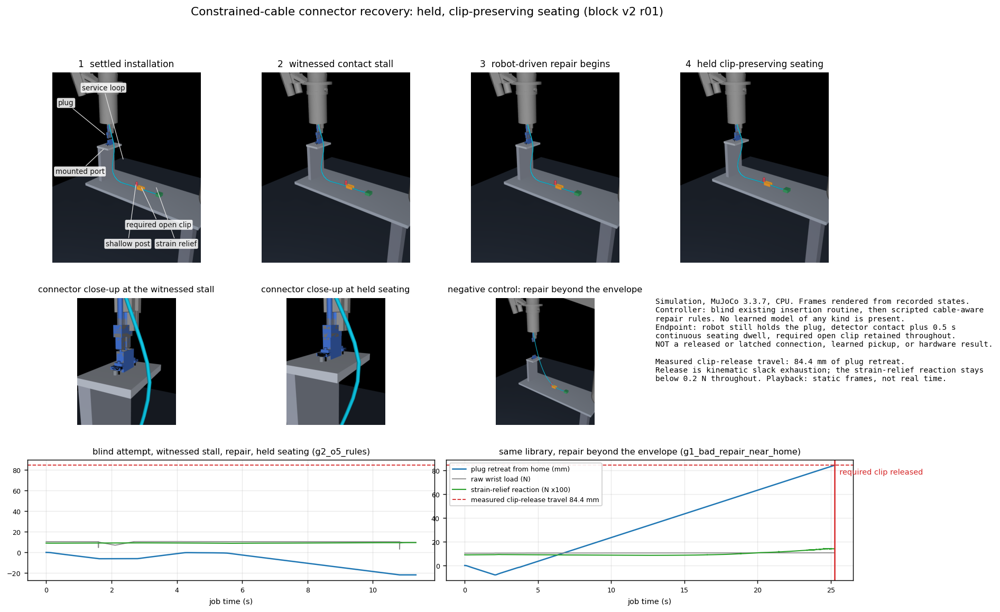

# Assembly Recovery Lab

**Help a robot recover from connector insertion failures without pulling a cable out of work already completed.**

The industrial problem is interrupted work: an insertion misses, binds or stalls, and the robot needs another chance without damaging the part or disturbing the harness around it. The active cycle studies industrial cable handling and SC connector insertion with pinned Intrinsic AIC assets through a project-owned native MuJoCo adapter. Everything here is simulation. The preserved Franka/FORGE peg study is kept below; its scores are not cable results.

[ROADMAP.md](ROADMAP.md) has the verified state and the single next action. [AGENTS.md](AGENTS.md) has the operating rules. [evidence/INDEX.json](evidence/INDEX.json) lists every evidence record with its own declared scope so you can pick one without reading many. These three Markdown files are the only maintained prose.

## The task, as built and executed

**Endpoint:** held, clip-preserving seating before gripper release. The robot still holds the plug, real tip/base engagement and a continuous 0.5 s dwell are reached before the deadline, the required open clip stays captured, and no load limit or state-mutation rule is broken. Released or latching connection, electrical function, learned pickup and hardware transfer are later claims needing their own evidence.



The fixture is world-fixed: a mount plate on standoffs carrying the SC port, a riser, a shelf on a support column, one physically escapable open clip, one shallow post, and an instrumented strain relief. A 0.46 m capsule cable is clamped at the plug boot and at the strain relief. Every frame above is rendered from a state recorded during the run that produced the traces beside it.

## What the executed block establishes

| Executed evidence | What it establishes | What it does not establish |
| --- | --- | --- |
| Held clip-preserving seating, 24 of 35 requests | The endpoint is reachable and measurable on real physics under a scripted controller, with the required clip captured throughout | Any learned result, released or latched connection, or reliability beyond a small deterministic grid |
| Clip releases after **84.4 mm** of plug retreat | A quantified recovery envelope for this routing, measured at a 4 mm/s ramp, with the strain-relief reaction under 0.2 N throughout | A tension limit, a hardware clip rating, or an envelope for any other routing |
| Witnessed stall, then robot-driven repair to held seating on two layouts | A physically generated failure and a real repair, not a posed frame or a geometric path | That prevention is impossible; the same offsets are prevented by a competent first attempt |
| The same macro loses the clip near home and preserves it from the inserted pose | The distal constraint is real and reachable, and an action's consequence depends on the state it is issued from | That a learned predictor is needed, or that rules cannot capture this dependence |
| 34 of 34 replayable verdicts reproduced from the ledgers alone | Stored ledgers are sufficient to recompute every status, reason, witness, dwell and elapsed time independently | A second physical measurement; replay is an accounting check |
| 4 kHz and 8 kHz leave duration, dwell, ticks and outcome unchanged | Physical clocks are independent of the integrator over that pair | Convergence, or resolution-independence of peak contact sums, which differ by about 70% |
| 18 of 18 screen requests completed under both arms | A strong, useful industrial baseline on the registered support | A residual problem worth learning; no witness fired, so the repair layer never ran |

The [block record](evidence/cable_recovery_block_v2.json) carries every number, its scope and the preserved failures, including a 46-segment spatial-refinement control that does **not** survive its own settling transient. Discretisation insensitivity is therefore not established.

## Why learning is not yet earned

Gate G4 requires competent rules or planning to leave a reproducible feasible residual failure, or a predeclared material cost deficit. On the registered support they leave neither. Exact target knowledge plus bounded force-guided retries prevents every screened cell, and a prevented visible offset is prevention, not recovery. That is a result about this support, not a claim that learning is unnecessary in general. The next block widens the support to conditions competence cannot prevent, then re-screens before any acquisition or training.

## What would make the contribution worthwhile

A graph or prediction network is not the contribution by itself. [Wilson](https://arxiv.org/html/2303.11765v1) already studies tactile cable assembly and retries; [Luo](https://arxiv.org/html/2307.08927v5) studies learned corrective selection; [Kienle](https://arxiv.org/html/2503.09409v1) uses predictive models for connector optimization. Cable-load compensation is established. The [research critique](evidence/cable_research_critique_v2.json) records the inspected methods and their overlap.

The attainable contribution is an empirical answer: **when do learned repair consequences improve constrained-cable recovery, at what data and inference cost, and on which unseen layouts or mechanical combinations?** The measured state-dependence above is the shape of that question in this task: one macro, two opposite outcomes, decided by a cable configuration the robot must infer. A positive claim still needs held-out action validation, better closed-loop clip-preserving outcomes, matched budgets, ablations and multiple training starts. A useful negative result identifies where a simpler method already suffices. Neither outcome is guaranteed.

## Run the checks and reproduce the block

```powershell
.venv/Scripts/python.exe scripts/setup_cable.py
.venv/Scripts/python.exe -m ruff check src scripts tests
.venv/Scripts/python.exe -m pytest
.venv/Scripts/python.exe scripts/run_cable.py --run-id my-run --worker scripts/evaluate_cable_recovery_v2.py --config configs/cable_recovery_task_v2.json --max-minutes 45 -- --workers 12
.deps/cable-venv/Scripts/python.exe scripts/review_cable_recovery_v2.py --run-dir artifacts/cable/my-run --out evidence/replay.json
.deps/cable-venv/Scripts/python.exe scripts/render_cable_recovery_v2.py --run-dir artifacts/cable/my-run
```

The launcher captures the commit, dirty state, source archive, asset hashes, environment and command before the worker starts, and reserves an immutable run id. The [dependency lock](configs/cable_dependencies_v1.json) pins the native runtime. Dynamics run on CPU; the old 2,048-environment peg result does not establish cable capacity. Measured throughput on this workstation is about 2.1k native steps/s per worker and 25k aggregate on 12 workers, with rendering included.

The first free-cable cycle is preserved unchanged: its [baseline](evidence/cable_baseline_v2.json), [native validation](evidence/cable_robot_validation_v1.json), [retention measurements](evidence/cable_retention_v1.json) and [replay video record](evidence/cable_video_v1.json) keep their original scopes, and the [direction audit](evidence/cable_direction_audit_v2.json), [technical audit](evidence/cable_technical_audit_v2.json) and [study contract](configs/cable_recovery_study_v2.json) remain the governing design documents.

## Preserved peg study

The Franka/FORGE peg-insertion study that preceded this cycle is preserved in full. Its explanation, executed results, closed decision and website/manuscript notes are kept verbatim in [evidence/readme_peg_history_v1.json](evidence/readme_peg_history_v1.json), and its evidence files ([peg validation](evidence/peg_validation.json), [research cycle decision](evidence/research_cycle_decision_v1.json), [training capacity](evidence/training_capacity_v2.json), [comparison figure](evidence/research_cycle_v1.png)) are unchanged. Peg scores are historical peg evidence and are never cable results.
