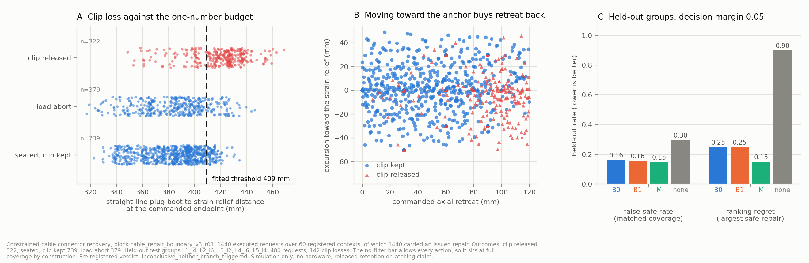

# Assembly Recovery Lab

**When a robot's connector insertion fails and it has to back off and try again, how far can it back off before it pulls the cable out of a clip it already seated — and does answering that need machine learning?**

It does not. A single fitted number answers it as well as anything else we could build.

Everything here is simulation, on a UR5e with pinned [Intrinsic AIC](https://github.com/intrinsic-ai/assembly-industrial-benchmark) SC connector assets through a project-owned native MuJoCo adapter.

## The result

We built a constrained-cable connector task, pre-registered a decision rule, and executed **1,440 physical repair attempts** across 60 registered cable layouts and mounting conditions — 101.7 million simulation steps and 9.1 worker-hours in 46 minutes of wall time, every request kept in the denominator.

Three predictors, identical inputs, identical actions, held out by whole layout family:

| Predictor | What it sees | False-safe rate | Wrong repair issued |
| --- | --- | --- | --- |
| **no filter** | nothing; every repair allowed | 0.296 | **18 of 20 contexts** |
| **B0** analytic budget | one number: straight-line plug-boot to strain-relief distance at the commanded endpoint | 0.162 | 5 of 20 |
| **B1** feature model | 14 hand-designed features | 0.156 | 5 of 20 |
| **M** learned model | the whole 24-vertex cable centreline, pose and action | 0.148 | 3 of 20 |

**Having a safety filter is worth a great deal. Which filter you use is worth almost nothing.** One fitted scalar — a 409 mm threshold — cuts wrong repairs by 72%. The 14-feature model made *the identical decision in all 20 held-out contexts*. The learned model differed in 2 of 20, a difference smaller than its own spread across three training seeds (0.15 / 0.25 / 0.50, mean 0.30 — worse than B0's 0.25) and inside a bootstrap interval that contains zero (B0−M false-safe +0.016, 95% CI [−0.017, +0.050]).

**The pre-registered verdict was `inconclusive`, and that is reported as the result.** B0 fell inside the declared margin on one metric and outside it on the other. The reason is a flaw in our own pre-registration, recorded rather than quietly fixed: the margin was set to 0.05 and the ranking metric's resolution is one context in twenty, which is also 0.05. A margin equal to the smallest difference a metric can express cannot decide anything. The full record is in [evidence/cable_repair_boundary_v3.json](evidence/cable_repair_boundary_v3.json).



## In plain English

A robot has to plug a connector into a socket. The connector has a cable, and that cable is clipped into a bracket partway along its run, the way a real wiring loom is dressed. If the first attempt to plug it in fails, the robot backs off and tries again — but the cable is only so long. Back off too far, or in the wrong direction, and the cable lifts out of its clip. The robot has now undone work it had already finished, and a person has to re-dress the loom by hand.

So before the robot makes a recovery move, it should ask: *will this move pull the cable out?* We measured whether answering that needs a learned model of the cable, or whether simple geometry is enough.

Simple geometry is enough. Measure the straight-line distance from where the cable leaves the connector to where it is clamped down, work out what that distance will be after the proposed move, and refuse the move if it exceeds one threshold. That rule is as good as a neural network that watches the whole shape of the cable.

## Why you can believe the numbers

The measurement apparatus is the part that took the longest, and it is the part worth interrogating.

| Property | How it is enforced |
| --- | --- |
| **Separated clocks** | 50 Hz policy, 500 Hz servo, 4 kHz physics. Doubling the physics rate leaves job duration, servo tick count, dwell and outcome unchanged (clip margins agree to 2e-8 m). |
| **One authoritative force stream** | A single post-step native solve. No maximum over two sampling points. The strain-relief reaction is read from the constraint rows, cross-checked against a sensor whose 0.0496 N static offset is measured by an unloaded control. |
| **Fail-closed mutation guard** | Wraps every controller call. A deliberate 1e-4 rad pose write fails the job. **0 forbidden events across all 1,440 requests.** |
| **Exact replay** | 34 of 34 replayable v2 requests reproduce status, reason, witness, dwell and elapsed time from the stored ledgers alone. |
| **Honest denominator** | Every registered request counts — load aborts, settling rejections, infeasible constructions. 1,440 requested, 1,440 executed, 1,440 scored. |
| **Frozen before launch** | Support, action design, group split, predictor budgets and the decision margin were committed at `01d87b4`; the analysis code was committed at `3b11c1f` while the block was still running. The run's own manifest records a clean tree at the pre-registration commit. |
| **Measured, not declared** | The compliant mount reproduces its declared stiffness to a relative error of 1.9e-13 with off-axis coupling at 1.3e-16 m — under a known load, not by assertion. |

## What the block measured

**The physical envelope is a geometric constant, to 1.4%.** The open clip releases after 84.40 mm of plug travel at 4 mm/s, 84.88 mm at 20 mm/s and 85.59 mm at 40 mm/s — a 1.41% spread over a tenfold change in speed, with the strain-relief reaction under 0.2 N throughout. It is slack exhaustion, not a tension failure. ([controls](evidence/cable_boundary_controls_v3.json))

**State decides an action's consequence, and now at population scale.** The v2 block found one macro with two opposite outcomes depending on the pose it was issued from. Across 1,440 requests that generalises: the same repair library issued near the home pose releases the clip in **28.1%** of requests against **16.7%** from the engaged pose.

**Mount compliance halves force aborts and changes nothing else.** A finite-stiffness bracket cuts load aborts from 36.8% to 15.8% and raises completion from 42.8% to 59.9%, because it yields instead of building force when the plug retreats from an engaged connector.

**Layout dominates.** Clip loss ranges from 10.8% to 37.2% across the five registered layouts — which is exactly why held-out groups are whole layout families and never neighbouring actions.

**Competence with live state is not defeated by mechanical perturbation.** [18 of 18](evidence/cable_recovery_block_v2.json) on mounting offsets, then [15 of 15](evidence/cable_support_probes_v3.json) across an eightfold range of mount stiffness crossed with 0–4 mm offsets. Every arm is handed the port's live pose at 500 Hz, so a port that moves under contact is simply tracked. This is a result about *this observation interface*, not a claim that compliance is harmless in general — and it is why the study measures the repair boundary rather than a rescue rate.

## What we got wrong, and found

Four defects surfaced during this work. They are listed because finding them was most of the value.

- **A recorded provenance hash that no committed file reproduces.** The v2 block records `8d9082…` for its config; the committed blob is `34d08b3b…`. Identical content: the archived copy had 1,569 CRLF line endings and git stores LF. A raw byte hash of a text file hashes the checkout, not the content. Hashes are now taken on normalised bytes with the raw hash recorded beside them.
- **A declared parameter that did nothing.** `RepairMacro.speed_m_per_s` was carried through the controller and never applied — every repair ran at the slow insertion approach speed. It was invisible because every macro in the library happened to declare exactly that speed. No recorded result changed; verified by re-running the v2 repair controls, which reproduce their dwell, clip margin and step count exactly.
- **A waypoint that could never retire.** A repair waypoint advanced on *tip* arrival, so a waypoint the cable held the tip short of consumed the whole 40 s deadline in silence. A registered settling window now retires it on reference arrival and counts the lag.
- **An undocumented definition behind a headline number.** The published 84.4 mm envelope is the plug tip's *three-dimensional* travel; its axial component is 84.25 mm. The 0.14 mm gap is the lateral excursion the cable pulls the plug through as it comes taut. Both are now reported.

And one that is still open: **the 46-segment cable refinement does not survive its own settling transient at 4, 8 or 16 kHz.** It is not an integration-step artefact. Discretisation insensitivity is *not* established, and every number here is scoped to the 23-segment model. Peak contact sums also move about 70% between physics resolutions while outcomes do not, so they are never quoted as resolution-independent.

## Reproduce it

```powershell
.venv/Scripts/python.exe scripts/setup_cable.py
.venv/Scripts/python.exe -m ruff check src scripts tests
.venv/Scripts/python.exe -m pytest
```

```powershell
.venv/Scripts/python.exe scripts/run_repair_boundary_v3.py --run-id my-run --workers 12 --max-minutes 150
.venv/Scripts/python.exe scripts/fit_repair_boundary_v3.py --run-dir artifacts/cable/my-run --out evidence/my-fit.json
.deps/cable-venv/Scripts/python.exe scripts/controls_repair_boundary_v3.py
.deps/cable-venv/Scripts/python.exe scripts/render_repair_boundary_v3.py --dataset artifacts/cable/my-run/study_dataset.json --report evidence/my-fit.json --out evidence/my-fig.png
```

The runner refuses to launch if the frozen task it merges onto is not the one the contract declares. The launcher captures commit, dirty state, source archive, asset hashes, environment and command before the worker starts, and reserves an immutable run id. Measured throughput on this block is **3,117 native steps/s per worker and 37,147 aggregate** on twelve, so its 101.7 million steps took 45.6 minutes of wall time. Dynamics are CPU MuJoCo 3.3.7. 446 tests run without a GPU, a simulator or any ignored artifact.

## Scope

Simulation only. No hardware, no connector transfer, no released or latched connection, no electrical function, no learned pickup, no grasp-robustness result and no force-certified safety claim. The endpoint is **held, clip-preserving seating before gripper release**: the robot still holds the plug, real tip/base engagement and a continuous 0.5 s dwell are reached before the deadline, the required open clip stays captured, and no load limit or state-mutation rule is broken. The preset grasp and the world-fixed shelf, clip, post and strain relief are disclosed construction boundaries. Every arm reads simulator state, not camera perception. Bracket compliance is translational only.

This is one task, one connector, one cable model and one observation interface. "A single scalar suffices" is a measured statement about that, not about cable manipulation in general.

## Where things are

[ROADMAP.md](ROADMAP.md) has the verified state and what is closed. [AGENTS.md](AGENTS.md) has the operating rules. [evidence/INDEX.json](evidence/INDEX.json) lists all 85 evidence records with their own declared scopes, so one can be chosen without reading many. These three Markdown files are the only maintained prose.

Prior art this positions against, checked 2026-09-10: [WireCraft](https://arxiv.org/abs/2606.18097) benchmarks constrained-cable connector insertion and clip routing; [joint shape and tension prediction](https://arxiv.org/abs/2505.13889) already enforces safe planned cable motion; [FAR](https://arxiv.org/abs/2607.01111) and the tactile, corrective and predictive connector work already do retry and recovery. Building a cable task, predicting a safe motion, and retrying after failure are all established. What is measured here is a repair spending a *physical budget it can overdraw, undoing a step already completed* — and how little of the state you need to see to stay inside it.

The Franka/FORGE peg-insertion study that preceded this cycle is preserved in full in [evidence/readme_peg_history_v1.json](evidence/readme_peg_history_v1.json) with its evidence files unchanged. Peg scores are historical peg evidence and are never cable results.
