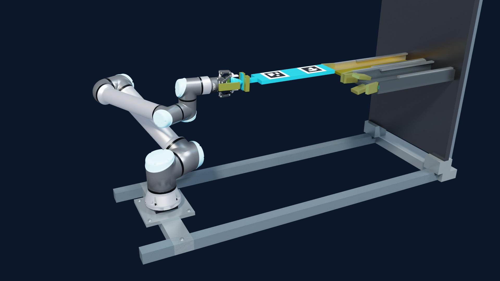

# Orbital Robotic Servicing Lab

Design and simulation of a robot that moves a compute module between two rack
bays in zero gravity. The goal is to identify what modular hardware needs for
autonomous servicing: a graspable interface, sufficient clearance, reliable
alignment, and a rack that holds the module after the robot releases it.

A stationary UR10e arm performs the transfer in one continuous Isaac Lab
simulation. PPO policies capture and begin extracting the module; a guarded
terminal path finishes the pull. Smooth solved motion carries it, and
camera-guided insertion seats it before the robot releases both supports.
RGB-D cameras track flush markers on the module. This models mechanical
transfer, not electrical reconnection or a complete failed-unit/spare cycle.

[](docs/media/orbital-stable-demo.mp4)

[Watch the continuous simulation](docs/media/orbital-stable-demo.mp4): 43.1 seconds
of recorded motion at real-time playback, followed by a 1.5-second still hold.
The frame illustrates the fixed mounting assumption; it adds no simulated
support or collision geometry. [What the recording shows](docs/DEMOS.md)

## Run a verified mission

The mission application checks its checkpoints and validation evidence before
starting. It records the robot, verifies seating and release, then hashes the
report, video, and motion traces. Its three frozen checkpoints are included
in [policies/servicing_v2](policies/servicing_v2), about 4 MB in total.

```powershell
python -m pip install -e .
zero-g-mission preflight
zero-g-mission run --seed 6070
zero-g-mission verify <path-to-job.json-printed-by-the-run>
```

The live run needs the local Isaac Sim installation described in
[Installation](docs/INSTALL.md). Preflight reports missing requirements.
Verification runs on an ordinary CPU without Isaac or the original checkpoints.
[Mission commands and API](docs/compute_service_demo.md) covers outputs, cancellation,
and reproducing the validation.

The selected fixed-base recording passed all nine mission checks: **1,302/1,302
camera detections**, **0.221 mm maximum transit drift**, and **0.733 seconds held
by the rack alone** after both robot supports released. It is one development
episode at seed 6070, not a reliability rate. The service profile is checked
separately against its exact launch command and runtime source hashes.
[Motion evidence and limits](docs/TRANSFER_STABILITY.md) ·
[Profile validation](evidence/live_service_stability_validation_seed6070.json) ·
[Normal worker validation](evidence/live_service_stability_application_seed6070.json)

## What changed in the transfer

The original recording spent 7.17 seconds moving slowly near the extraction
plane and translated the robot base by 245 mm. In the refined recording, that
low-speed interval totals 0.17 seconds, the base stays still, and peak sampled
module acceleration during transfer falls from 2.711 to 0.288 m/s². These are
measurements of two recordings, with several controller changes made together.
They do not establish a general performance gain.
[Controller changes, comparison and reproduction](docs/TRANSFER_STABILITY.md)

The corrected recipe completed **6/8** matched conditions at seed 4070, versus
**5/8** for the legacy recipe, with no success-to-failure changes. The physical
retention/release audit agrees. Validation was shortened at the owner's request
before the planned 24 conditions per arm: seed 5070 was interrupted and 6070
was not run. This development check does not qualify the 95% target.
[Partial comparison and retained artifacts](evidence/workflow_stability_paired_summary.json)

## Earlier research results

These results belong to their original controller configurations. They are
preserved for comparison and are not recertification of the fixed-base recipe.

| Experiment | Result | Scope |
| --- | ---: | --- |
| Full transfer using simulator state | **22/24 (91.67%)**, 95% interval **[74.2%, 97.7%]** | Three held-out seeds; rack-only hold required |
| Original camera-driven transfer | **4/24 (16.67%)** | Same camera pipeline as its 20/24 oracle-pose control |
| Previous v2 application recipe | **17/24 (70.83%)** | Noise-trained extraction, robot-kinematic velocity, lead-in guard and moving robot carriage |

These recorded full-transfer cohorts remain below the unchanged **95%** gate.
The selected video and current service validation are separate from these
pooled measurements. [Results, evidence, and reproduction details](docs/NOW.md)

A strong isolated skill did not guarantee a strong system: learned force-aware
seating scored **99.20%** alone, but **24/96** inside the chain versus **23/96**
for guarded insertion on the same prescribed rack. The controller's performance
also depended on the bay geometry. [Seating comparison](docs/seating_controller.md)

The mechanical design matters as much as the policies. A wider channel admits
more misalignment but also allows a released module to remain off-centre.
The CPU design tools calculate those competing requirements before another
training run is needed:

```powershell
python scripts/derive_rack_requirement.py
python scripts/check_channel_holds_its_tolerance.py
```

The second command reports the shipped bay as incompatible with a guarantee of
passive seating. It does not say the robot cannot seat a module there; active
alignment and rack retention are part of the solution.

## Limits and evidence

Everything is simulated; nothing has run on hardware. Robot-side and rack-side
locks use **idealized** joint load paths. The new recipe keeps the robot base
stationary and fixed to the world; spacecraft reactions and flight dynamics
are not simulated.
The broader serviceability envelope is **not qualified**.
[Simulation limits and proposed bench tests](docs/sim_to_real.md)

The [evidence manifest](evidence/MANIFEST.json) distinguishes current, historical,
and retracted reports. Some older experiments used uncommitted code and remain
unreproducible; [T0](docs/NEXT_WORK.md#t0) tracks that gap. The mission checkpoints
are now included, while the full training archives and rendered datasets remain
local. Failed results are retained.

Built with Python, NVIDIA Isaac Sim / Isaac Lab, PhysX, PyTorch / RL-Games,
OpenCV ArUco and NumPy. The optional local API uses FastAPI.

[Current state](docs/NOW.md) - [Roadmap](ROADMAP.md)
[Demo provenance](docs/DEMOS.md) - [Script index](scripts/README.md)
[Mechanical specification](docs/service_interface_spec.md) - [License](LICENSE)
